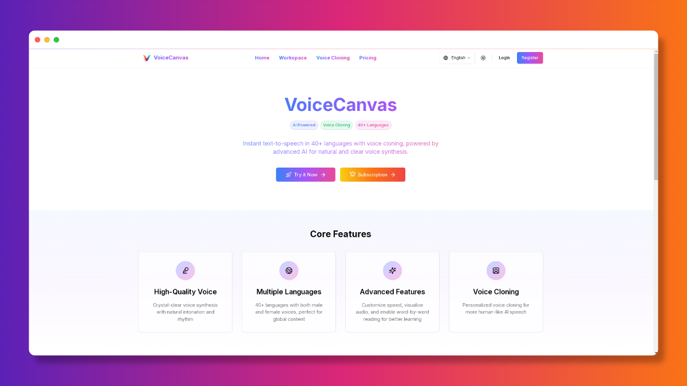

# Open-VoiceCanvas

Open-VoiceCanvas 是一个功能强大的多语言语音合成与克隆平台，基于 Next.js 14 构建。它集成了多种顶尖的 AI 语音技术，为用户提供高质量的文字转语音 (TTS)、语音克隆、语音设计以及播客和故事生成服务。



## 🌟 主要功能

### 🎙️ 核心语音服务
- **多引擎支持**: 集成 OpenAI TTS、AWS Polly、MiniMax 等顶级语音合成引擎。
- **多语言覆盖**: 支持全球 50+ 种语言和方言。
- **语音克隆**: 上传音频样本即可快速克隆声音，打造个性化语音助手。
- **语音设计**: 自定义音色参数（语速、音调、音量等），创造独一无二的声音。

### 🎨 创意工坊
- **播客生成**: 自动生成多人对话形式的播客音频。
- **故事创作**: 智能生成配音故事，支持长文本处理。
- **实时预览**: 支持文本到语音的实时流式播放和音频可视化波形展示。

### 🛡️ 企业级特性
- **用户认证**: 完善的注册/登录系统，支持 GitHub、Google 第三方登录。
- **订阅支付**: 集成 Stripe 支付系统，支持按月/年订阅及按量付费模式。
- **配额管理**: 精确的字符数和克隆声音数量配额控制。
- **国际化**: 原生支持多语言界面 (i18n)。

## 🛠️ 技术栈

### 前端
- **框架**: [Next.js 14](https://nextjs.org/) (App Router)
- **语言**: TypeScript
- **样式**: [Tailwind CSS](https://tailwindcss.com/)
- **组件库**: [shadcn/ui](https://ui.shadcn.com/), Radix UI
- **动画**: Framer Motion
- **状态管理**: React Hooks

### 后端 & 基础设施
- **数据库**: PostgreSQL (适配 Neon/Supabase)
- **ORM**: [Prisma](https://www.prisma.io/)
- **认证**: [NextAuth.js](https://next-auth.js.org/) (Auth.js)
- **支付**: Stripe API
- **邮件**: Resend
- **存储**: AWS S3 / Vercel Blob (用于音频存储)

### AI 服务集成
- **OpenAI**: TTS 模型
- **AWS**: Polly 服务
- **MiniMax**: 中文语音优化
- **DeepSeek / Qwen**: 文本处理与生成支持

## � 快速开始

### 环境要求
- Node.js 18+
- PostgreSQL 数据库
- 各类 API Keys (OpenAI, AWS, Stripe 等)

### 1. 克隆项目
```bash
git clone https://github.com/ItusiAI/Open-VoiceCanvas.git
cd Open-VoiceCanvas
```

### 2. 安装依赖
```bash
npm install
# 或者
yarn install
# 或者
pnpm install
```

### 3. 配置环境变量
复制 `.env.example` 文件为 `.env`，并填入你的 API 密钥和配置信息：

```bash
cp .env.example .env
```

关键配置项说明：
- `DATABASE_URL`: PostgreSQL 连接字符串
- `NEXTAUTH_SECRET`: NextAuth 加密密钥
- `OPENAI_API_KEY`: OpenAI 接口密钥
- `STRIPE_SECRET_KEY`: Stripe 支付私钥
- `AWS_ACCESS_KEY_ID`: AWS 访问密钥 (用于 Polly)

### 4. 数据库迁移
使用 Prisma 同步数据库结构：

```bash
npx prisma generate
npx prisma db push
```

### 5. 启动开发服务器
```bash
npm run dev
```

访问 [http://localhost:3000](http://localhost:3000) 查看应用。

## � 项目结构

```
Open-VoiceCanvas/
├── app/                 # Next.js App Router 页面与 API
│   ├── api/             # 后端 API 路由
│   ├── auth/            # 认证相关页面
│   ├── cloning/         # 语音克隆页面
│   ├── design/          # 语音设计页面
│   ├── podcast/         # 播客生成页面
│   └── ...
├── components/          # React 组件
│   ├── ui/              # 基础 UI 组件 (shadcn)
│   └── ...              # 业务组件
├── lib/                 # 工具函数与库配置
│   ├── i18n/            # 国际化配置
│   ├── prisma.ts        # 数据库客户端
│   └── ...
├── prisma/              # 数据库 Schema 与迁移
├── public/              # 静态资源
└── scripts/             # 维护与工具脚本
```

## � 脚本命令

- `npm run dev`: 启动开发服务器
- `npm run build`: 构建生产版本
- `npm run start`: 运行生产版本
- `npm run lint`: 代码风格检查
- `npm run db:analyze`: 数据库分析脚本
- `npm run check:translations`: 检查翻译缺失

## 🤝 贡献

欢迎提交 Pull Request 或 Issue！

1. Fork 本仓库
2. 创建特性分支 (`git checkout -b feature/AmazingFeature`)
3. 提交更改 (`git commit -m 'Add some AmazingFeature'`)
4. 推送到分支 (`git push origin feature/AmazingFeature`)
5. 提交 Pull Request

## 📄 许可证

[MIT](LICENSE) © ItusiAI
